# CareLink Deployment Guide

## 🚀 Production Deployment Checklist

### Required GitHub Secrets

Set these secrets in your GitHub repository:

1. **Authentication Secrets (Required)**
   - `ROLE_COOKIE_SECRET` - 32+ character string for cookie signing
   - `JWT_SECRET` - 32+ character string for JWT signing

2. **API Configuration (Required)**
   - `NEXT_PUBLIC_API_BASE_URL` - Your API base URL (e.g., `https://api.carelink.example.com`)

3. **Monitoring (Optional)**
   - `SENTRY_DSN` - Sentry DSN for error tracking

4. **Vercel Integration**
   - `VERCEL_TOKEN` - Vercel deployment token
   - `VERCEL_ORG_ID` - Your Vercel organization ID
   - `VERCEL_PROJECT_ID` - Vercel project ID
   - `PRODUCTION_URL` - Your production domain URL

### Quick Setup

#### 1. Generate Secrets

```bash
# Generate secure secrets (32+ characters)
ROLE_COOKIE_SECRET=$(openssl rand -base64 32)
JWT_SECRET=$(openssl rand -base64 32)

echo "ROLE_COOKIE_SECRET=$ROLE_COOKIE_SECRET"
echo "JWT_SECRET=$JWT_SECRET"
```

#### 2. Set GitHub Secrets

Go to your GitHub repository → Settings → Secrets and variables → Actions

Add all the required secrets listed above.

#### 3. Configure Vercel

1. Connect your GitHub repo to Vercel
2. Set up your custom domain in Vercel dashboard
3. Ensure HTTPS is enforced

### Deployment Workflows

#### Automatic Deployment

- **Production**: Push to `main` branch automatically deploys to production
- **Preview**: Use workflow dispatch for preview deployments

#### Manual Deployment

```bash
# Deploy preview
gh workflow run deploy.yml

# Or trigger from GitHub Actions UI
```

### Security Verification

After deployment, verify these security features:

#### 1. Health Check

```bash
curl https://api.your-domain.com/v1/health
# Expected: {"ok":true}
```

#### 2. Security Headers

```bash
curl -I https://your-domain.com
```

Should include:

- `Strict-Transport-Security`
- `Content-Security-Policy`
- `X-Frame-Options: DENY`
- `X-Content-Type-Options: nosniff`

#### 3. Cookie Security

Test login endpoint:

```bash
curl -X POST https://your-domain.com/api/auth/login \
  -H "Content-Type: application/json" \
  -d '{"email":"demo@example.com","password":"demo123"}' \
  -v
```

Verify `Set-Cookie` header contains:

- `HttpOnly`
- `Secure` (in production)
- `SameSite=Lax`

### Application-Specific Domains

Configure custom domains for each app:

- **Main Web**: `your-domain.com`
- **Platform**: `platform.your-domain.com`
- **Telehealth**: `telehealth.your-domain.com`
- **Mobile App**: `app.your-domain.com`
- **API**: `api.your-domain.com`

### Environment Configuration

Each app expects these environment variables:

```env
# Required in production
ROLE_COOKIE_SECRET=your-32-char-secret
JWT_SECRET=your-32-char-secret
NEXT_PUBLIC_API_BASE_URL=https://api.your-domain.com
NODE_ENV=production

# Optional
SENTRY_DSN=your-sentry-dsn
```

### Troubleshooting

#### Deployment Failures

1. Check GitHub Actions logs
2. Verify all secrets are set correctly
3. Ensure API health endpoint is accessible

#### Cookie Issues

1. Verify `ROLE_COOKIE_SECRET` is set and 32+ characters
2. Check browser dev tools for cookie flags
3. Ensure HTTPS is configured for `Secure` flag

#### CSP Violations

1. If using inline JSON-LD, generate hash with `sha256ForJsonLd()`
2. Add hash to `next.config.js` `jsonLdHash` variable
3. Keep CSP enforced (no `'unsafe-inline'`)

### Post-Deployment Tests

Run the full test suite after deployment:

```bash
# Cookie security tests
pnpm --filter @carelink/web test:e2e:cookie
pnpm --filter @carelink/platform test:e2e:cookie

# End-to-end tests
pnpm test:e2e

# Security scans (will run automatically in CI)
pnpm security:scan
```

### Production Monitoring

Monitor these endpoints:

- Health: `/v1/health`
- Version: `/v1/version`
- Diagnostics: `/api/diag`

Set up alerts for:

- Health check failures
- High error rates in Sentry
- Performance degradation
- Security scan failures

## 📋 Deployment Architecture

```mermaid
graph TB
    A[GitHub Push to main] --> B[GitHub Actions CI]
    B --> C{All tests pass?}
    C -->|Yes| D[Security Validation]
    D --> E[Build Apps]
    E --> F[Deploy to Vercel]
    F --> G[Post-deployment Health Checks]
    G --> H[Production Ready ✅]

    C -->|No| I[Deployment Blocked ❌]
```



The deployment pipeline ensures:

- ✅ All tests pass
- ✅ Security secrets are validated
- ✅ Health endpoints respond correctly
- ✅ Security headers are properly set
- ✅ Cookie security is enforced
